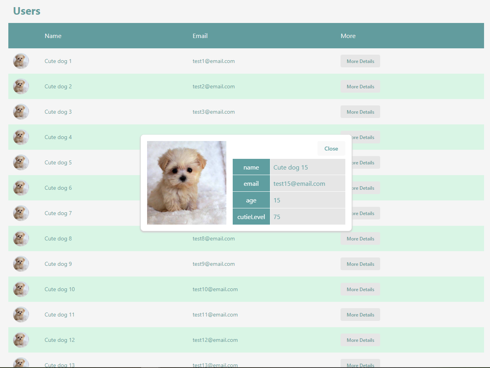

# Challenge 2: Data Fetching and Integration

Instructions: 

Create a React app that fetches data from an API endpoint and displays the information on the page. Use the following API endpoint to get user profiles: 

API Endpoint: https://example.com/api/user-profiles 

Each user profile should have the following structure: 

{ 

  name: string, 

  email: string, 

  avatar: string 

} 

Display this data in a responsive grid layout, and when clicking on a user profile, show a modal with more details (e.g., name, email, avatar, and any other relevant information). 

 

Specifications: 

- Create a new React app with appropriate configuration (e.g., using Create React App). 

- Fetch user profiles data from the given API endpoint. 

- Display the user profiles in a responsive grid layout, ensuring that the app looks good on various screen sizes. 

- When clicking on a user profile, show a modal with more details about the user (e.g., name, email, and avatar). 

- Implement the modal using a React component that appears when a user profile is clicked and disappears when closed. 

- Use CSS to style the app and make it visually appealing. 

## Result

